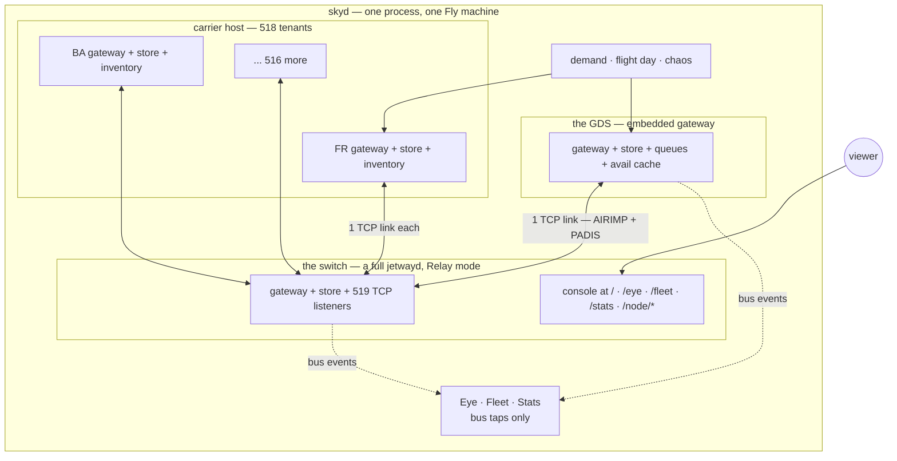

# wholesky

One Earth-day of passenger aviation, simulated on
[Jetway](https://github.com/adamf/jetway): every scheduled flight, every
booking, and every Type B and EDIFACT message that makes it go, over real
sockets.

**Live demo:** https://wholesky-demo.fly.dev/eye — the Eye, watching the
whole sky: 518 carriers, 2,883 airports, 57,513 flights a day, running
continuously on one machine.


The globe has a second mode: **net**, the logical web of who converses with
whom. The switch never appears — it is plumbing. Every relayed message
carries the id of the inbound it forwards, so the Eye resolves each relay to
a true src→dst conversation: carriers to the GDS, and carriers to their
interline partners, to whom availability is broadcast the way it really is.
Two layouts of the same graph — a force-directed **web**, where regional
communities pull themselves together by their own message springs (China
upper-left, the Americas upper-right, Europe below, with no geography told
to the layout), and a **ring** with the conversations as woven chords.
Everyone-talks-to-the-GDS is drawn as faint wallpaper; the ink goes to the
carrier-to-carrier web. Every node is one click from its own console.


**Every node has a real console.** Each of the 519 embedded Jetway systems —
the GDS and all 518 carriers — serves the full Jetway console at
`/node/{code}/`, wearing its own identity: open `/node/FR/` and you are
inside Ryanair's reservation system, its own message tape, records and
queues.


And `/stats` is the cluster's instrument panel: ten minutes of time series at
two-second resolution — message rates by wire format and traffic class,
bookings, airborne count, queue depths, and undeliverable-per-second, the
number that should be zero. The sixty-second AVS rebroadcast cycle is
plainly visible as a heartbeat in the charts.


Behind the globe sits **the fleet** at `/fleet`: every Jetway system in the
world as a live row — the switch, the GDS, and all 518 carrier tenants with
their hubs, dialects, link state and message counters, fed by tapping each
node's own event bus. Click a carrier for its records, queues and message
log; click a message for the bytes as they crossed the wire.


The coastlines are [Natural Earth](https://www.naturalearthdata.com)
1:110m, public domain, vendored at 76KB and embedded in the binary -- the
traffic still draws the cities. Drag to spin, scroll to zoom, and click any
airport for the one control the sky answers to:
**close it**. Every operating carrier then transmits a real ASM cancellation
for each affected flight, the GDS ingests them through the same
schedule-change path production traffic uses, and the red halo that grows
over the airport is a count of actual queue items -- bookings a person now
has to deal with. Closing Heathrow cancels ~680 flights in about seven
seconds of message traffic. Reopening it stops the cascade
mid-flight. And aircraft already airborne toward a closed airport do not
vanish: their operating carriers transmit real **DIV** messages naming the
nearest open alternate, the Eye reroutes each aircraft when the message
reaches the watcher, and the diverted planes turn amber as they turn away.

Every aircraft on that map is flying because a real MVT message crossed the
switch; the Eye subscribes to the buses the world already publishes on and
knows nothing the network cannot see. The stats line counts messages,
movements and bookings as the seeded demand books through the switch in both
wire dialects. The switch's own console lives at the root — open any message
and read it field by field. The machine suspends when nobody is watching and
thaws mid-flight, replaying the last two sim-hours as a burst.

Design: "The Whole Sky" (design note, 2026-08-31). The short version — the
sky is loud but it is not big. The world's reservation fabric peaks at a few
thousand messages a second; simulated honestly, with availability at its real
churn and a baggage message per bag per scan, it is still only tens of
thousands. What is interesting is not throughput but topology, and the
topology here mirrors the real one:

- **The switch** is a Jetway node in relay mode: the SITA role. Everyone
  holds one link to it and addresses everyone else by teletype address.
- **Carriers** are tenants of a host process — most of the world's carriers
  are tenants of a handful of hosted reservation systems, so the efficient
  shape and the realistic shape are the same shape.
- **The GDS** is a Jetway gateway with one switch link and a peer entry per
  carrier. A booking's sell crosses two links and comes back confirmed.
- **OTAs are not nodes.** They are demand: load generators speaking NDC and
  booking APIs. (Phase two.)

## How it is put together

One OS process; 520 Jetway instances as library assemblies; everything
between them crosses real TCP. The only full `jetwayd` is the switch -- the
same assembly the standalone binary runs, console included. The GDS and every
carrier are embedded gateways: own identity, own store, own console, one
socket each.



What is real: the wire (519 sockets, real framing, real Type B and EDIFACT
bytes, relay by address line and UNB recipient) and the state separation
(nothing moves between nodes except a message). What is not: process
isolation -- one panic takes the sky down, and all 520 share a scheduler.
That trade is deliberate: the topology mirrors the real industry, where most
carriers are tenants of a handful of hosted systems and everyone hangs off
one message network, and the whole planet idles here at ~1.1GB. The seams
for scaling out already exist -- a tenant host pointed at a switch across a
real network works unchanged.

## Building it

wholesky pins [Jetway](https://github.com/adamf/jetway) by tag, so it builds
like any Go module:

```sh
git clone https://github.com/adamf/wholesky
cd wholesky && go test ./...
```

To develop against an unreleased Jetway, add a `replace` directive pointing
at a side-by-side checkout and drop it before pushing.

## Running it

```sh
go run ./cmd/worldc -countries "United Kingdom,France,Germany" -carriers 30 -o europe.json
go run ./cmd/skyd -world europe.json -carriers 12 -book 8 -warp 240
```

`worldc` compiles a deterministic manifest — airports, carriers, daily
flights — from the vendored OpenFlights snapshot. Same seed, same world.
`skyd` boots it: switch, tenants, GDS, real TCP on loopback, then pushes
bookings through the fabric and runs the flight day at `-warp`, emitting a
real MVT for every departure and arrival. The switch's console is Jetway's
own, on `-console`, where every message can be opened and read field by field.

## Status

Phase one. Works, and `go test ./...` proves it on every run: world
compilation at any scale from a continent to the planet, deterministic by
seed; the switch/tenant/GDS topology over real sockets; bookings settled in
**both dialects** -- AIRIMP over Type B and PADIS over EDIFACT, relayed by
address line and UNB recipient respectively; continuous seeded demand (a
20-carrier European run: 299 bookings, 0 failures, both formats crossing the
switch); and the flight day as real MVT traffic (1,286 movements through the
fabric in the first simulated morning). The Eye serves the globe at `/eye`,
drawn entirely from bus events on one dependency-free canvas: an
orthographic projection when the manifest spans the world, flat for a
region; aircraft from movements; pulses from the message stream; chaos
halos from queue placements. The full 518-carrier world idles at ~1.1GB and
a fraction of a core, breathing to ~2 cores during the global morning
banks. Not yet: the real demand model (booking curve, channels, parties),
PNL/ADL and baggage, the virtual clock, weather systems
that close regions rather than airports.

## Licence

MIT. The vendored OpenFlights data is separately licensed under the Open
Database License; see Data below.

## Data

`data/` vendors the [OpenFlights](https://openflights.org) database
(airports, airlines, routes), Open Database License. The snapshot is
deliberately allowed to be stale: the simulation needs a plausible planet,
not this year's planet. A current OAG or Cirium snapshot dropped through the
same compiler produces today's world instead.
