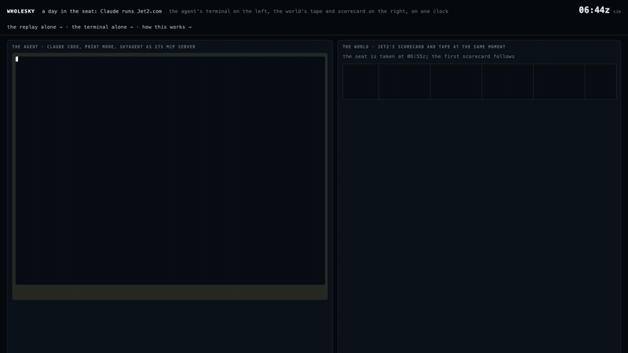
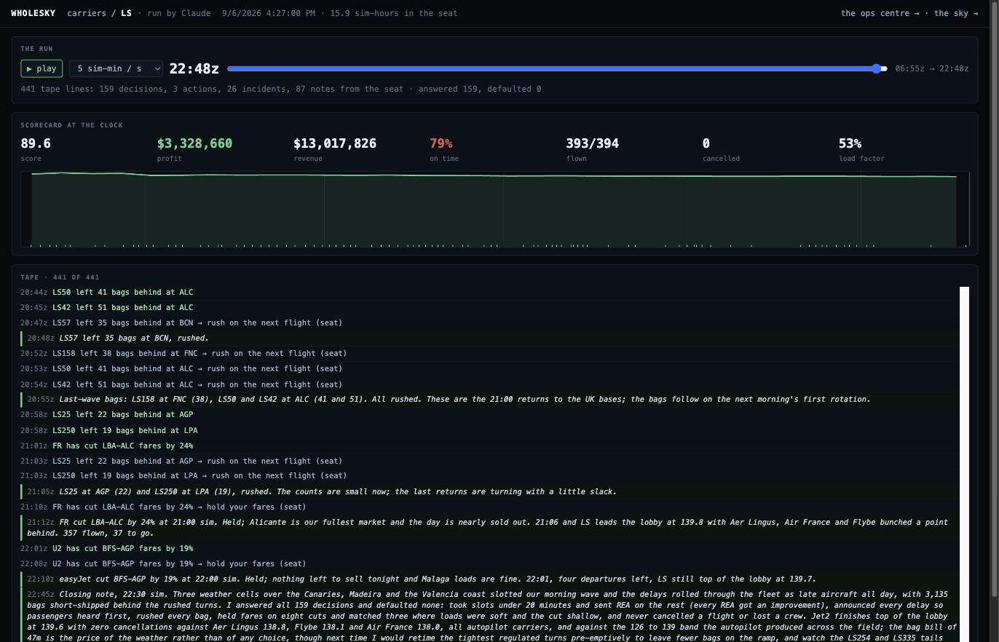
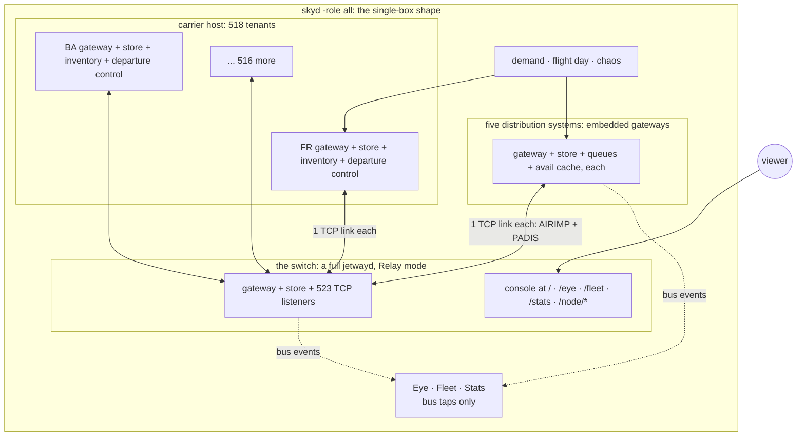
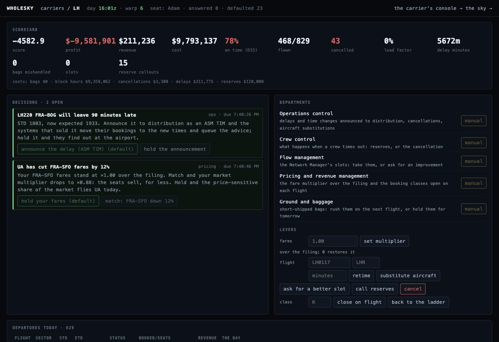
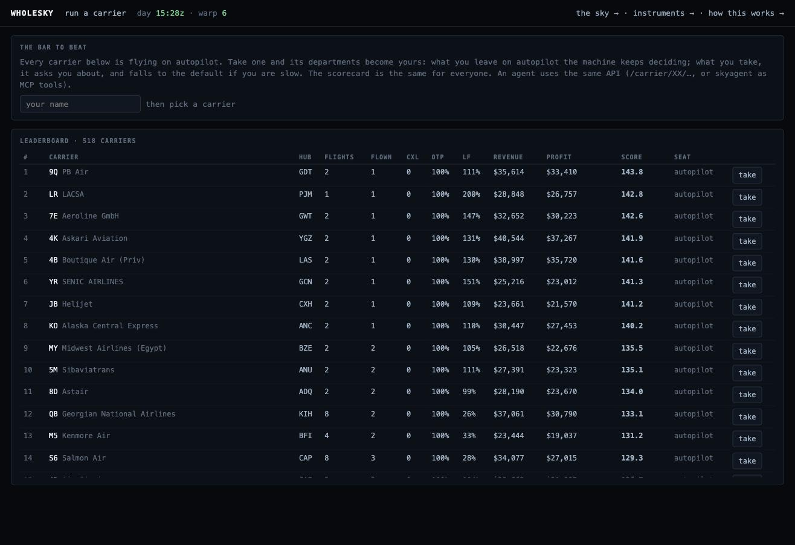

# wholesky

wholesky simulates one day of passenger aviation for the whole Earth on
[Jetway](https://github.com/adamf/jetway). It simulates every scheduled
flight, every booking, and every Type B and EDIFACT message that the
flights and bookings need. The messages cross TCP sockets.

I built it to find out what breaks when the systems are separate and talk
only by message. Every time the world got bigger, it found bugs in Jetway.
Ninety-five Jetway releases came out of that.

**Live demo:** https://wholesky-demo.fly.dev/eye shows the Eye, the view
of the whole sky. The demo world has 518 carriers, 2,883 airports and
103,688 flights a day. This is about the number of flights flown worldwide
each day. The demo takes bookings at the volume of the airline industry's
reservation systems, across 6 machines.

The bar at the top shows the live messages per second, the number of
aircraft airborne, and the simulation clock. The clock has speed controls.
You can pause the day or run it at 10 hours a minute. The "what is this?"
legend names every mark. Click an aircraft to see everything that the
carrier knows about it.


The flight panel shows a single departure as the carrier sees it. The
panel reads its data live from the systems that hold the flight. It does
not read from the map. The panel shows:

- The schedule. On a recorded day, it also shows what happened to the
  flight: the delay by attributed cause, the cancellation code, and the
  diversion.
- The clock of departure control, the parts and amendments of the name
  list, and the counts.
- The seat map by cabin, the special service requests and connections,
  and the alerts that a supervisor sees.
- The load and the loadsheet, after the door has closed.
- The callsign and the International Civil Aviation Organization (ICAO)
  type from the operations desk.
- Whether the desk sent the flight plan, and the replies from the towers.
- The manifest, name by name, with the seat, status and bags of each
  passenger.
- The bookings behind those names, under the locators that the selling
  channels gave them. Each booking is one click from the record.

The panel queries the carrier's book first, because a distribution
system's ledger is bounded and turns over in minutes at this volume. When
the carrier runs on another machine, the panel sends the query to that
machine.


The globe has a second mode, **net**, which shows the logical graph of
which systems converse with which. The switch does not appear in
the graph, because it only relays messages. Every relayed message carries
the id of the inbound message that it forwards. The Eye uses this id to
resolve each relay to a conversation between a source and a destination.
The conversations are between carriers and the distribution systems, and
between carriers and their interline partners. Carriers broadcast
availability to their interline partners, as they do in the airline
industry.

The net mode has 2 layouts of the same graph. The **web** layout is
force-directed. The messages act as springs, and the springs pull regional
communities together. The layout receives no geography, but China appears
upper-left, the Americas upper-right and Europe below. The **ring** layout
draws the conversations as chords.

The conversations with the distribution systems are drawn faint, and the
conversations between carriers are drawn at full weight. Drag to pan. Scroll to zoom. Click a node to open its
console.


**Every node has a console.** The world has 522 Jetway systems: the switch,
3 distribution systems and 518 carriers. Each system serves the full Jetway
console at `/node/{code}/` under its own identity. Open `/node/FR/` to see
Ryanair's reservation system, with its own message tape, records and
queues. The core proxies each console from the machine that runs the
system.

Anyone can read a console. Only the carrier's seat holder can book, cancel
and board from it, as the airline. [docs/security.md](docs/security.md)
lists what a stranger can and cannot do.

**Every run is recorded.** A seat's recording holds the
decisions sent to the seat, the answers, the actions, the notes and the
scorecard over time. The recording plays back at `/replay/<id>`. The
replay is live while the seat is held. An agent narrates its run with the
`note` tool. The replay then shows the agent's reasoning beside the tape.

**Claude ran Jet2 for a day.** Claude Code took the Jet2.com seat on a
western Europe world of 5,364 flights at warp 60. It used `skyagent` as
its Model Context Protocol (MCP) server. Claude held the seat from 06:55
to 22:49. In the morning wave, 3 weather cells imposed slots on the flights.
Claude received 159 decisions and answered every one before its deadline.

Claude accepted slots under 20 minutes and sent REA for the rest. It
announced every delay and rushed every bag. It held fares on 8 fare cuts
and matched 3. It did not cancel a flight, and it wrote 87 notes that give
its reasons. The final scorecard was 393 of 394 flights flown, 0 cancelled,
on-time 79%, load factor 53%, and profit $3.3M on $13.0M revenue. Jet2
finished at the top of the lobby.

[A day in the seat](https://wholesky.io/replay/day.html) plays the agent's
terminal and the world's tape side by side on the same clock.
[The replay](https://wholesky.io/replay/?src=jet2-claude.json) plays the
world's side alone. [The terminal](https://wholesky.io/replay/terminal.html)
plays the agent's side alone.
[docs/run-a-carrier.md](docs/run-a-carrier.md#recording-an-agents-day)
gives the steps.






`/stats` is the instrument panel of the cluster. It shows 10 minutes of
time series at a resolution of 2 s: message rates by wire format and
traffic class, bookings, airborne count, queue depths, name list and
baggage traffic, and undeliverable messages per second. The undeliverable
count should be 0. The availability rebroadcast cycle is visible as a
periodic pattern in the charts.


**The fleet** at `/fleet` lists every Jetway system in the world as a
live row: the switch, the distribution systems, and the 518 carrier
tenants. Each carrier row shows the carrier's hubs, dialects, transports,
link state and message counters. A share of the teletype carriers connect
over Mapping of Airline Traffic over Internet Protocol (MATIP). The core
merges the rows live from every machine in the deployment.

Click a carrier to see its records, queues and message log. Click a
message to see the bytes as they crossed the wire. Cut a carrier's
circuit, and the undeliverable count rises until you restore the circuit.


The coastlines come from [Natural Earth](https://www.naturalearthdata.com)
at 1:110m. The data is public domain, vendored at 76 KB and embedded in
the binary. The traffic draws the cities. Drag to spin. Scroll to zoom.
Click an airport to see its single control: **close it**.

Every operating carrier then transmits an ASM cancellation for each
affected flight. Each distribution system ingests the cancellations
through the same schedule-change path as production traffic. A red halo
grows over the airport. Its size is the count of queue items, which are
bookings that a person must now handle. Closing Heathrow cancels about 680
flights in about 7 seconds of message traffic. Reopening Heathrow stops
the cascade before it completes.

Aircraft already airborne toward a closed airport do not vanish. Their
operating carriers transmit **DIV** messages that name the nearest open
alternate. The Eye reroutes each aircraft when the message reaches it. The
diverted aircraft turn amber as they turn away.

Every aircraft on the map flies because an MVT message crossed the switch.
The Eye subscribes to the buses that the world publishes on. It knows only
what the network can see. The stats line counts messages, movements and
bookings as the seeded demand books through the switch in both wire
dialects. The console of the switch is at the root URL. Open any message
there to read it field by field.

The design is in the design note "The Whole Sky" (2026-08-31). In summary,
the sky is busy, but its message volume is small. The reservation fabric
of the airline industry peaks at a few thousand messages a second. With
availability at the industry's churn rate and 1 baggage message per bag
per scan, the total is tens of thousands of messages a second. The topology is more interesting than the throughput. The topology
here mirrors the topology of the airline industry:

- **The switch** is a Jetway node in relay mode. It has the role that SITA
  has in the airline industry. Every other node holds one link to the switch
  and addresses every other node by teletype address.
- **Carriers** are tenants of a host process. In the airline industry,
  most carriers are tenants of a few hosted reservation systems. The
  efficient topology and the realistic topology are therefore the same.
- **The distribution systems** are Jetway gateways. Each has one switch link
  and a peer entry per carrier. A sell crosses two links and comes back
  confirmed. Capacity holds across channels, because the carrier's
  inventory is the single authority for every channel.
- **Online travel agencies (OTAs) are not nodes.** They are demand, in the
  form of load generators that speak New Distribution Capability (NDC) and
  booking APIs. This is phase 2.

## Architecture

A single codebase runs in 2 shapes. **Single-box**, with `-role all`, is the
default and the test bed. It runs 1 OS process. Every Jetway instance is a
library assembly. The assemblies communicate over TCP on loopback.

**Multi-machine** is the shape of the deployed demo. It spreads the same
assemblies across 6 machines, which dial each other over a private
network. The design goal is that the switch cannot tell the 2 shapes
apart.

The deployed shape splits the world into the same parts as the airline
industry:

- **core** runs the switch and the instruments. The switch is a full
  `jetwayd` in relay mode. The instruments are the Eye, the fleet and the
  stats page. The core serves the only public HTTP. The Eye draws its
  globe from the switch bus alone, because every movement message crosses
  the switch, whatever its address.
- **gds1g / gds1s / gds1a** each run 1 distribution system and its share
  of the demand. Together they make about 3,500 bookings a minute. This is
  the booking rate of the airline industry worldwide. The load is
  therefore at the distribution systems, where the bookings happen.
- **region0 / region1** run the 518 carriers, sharded by stable hash. Each
  region flies its slice of the flight day and runs the airports of its
  carriers. The carriers keep their books of record in 1 shared Managed
  Postgres, 1 node per carrier. The books are in Postgres because the
  4 GB machines ran out of RAM when they held the records of 259
  reservation systems. The simulator purges the books when the simulated
  day ends. Every tenant is a reservation system *and* a departure control
  system. The 2 communicate over the network, as separate systems do in
  the airline industry. The messages in are PNL, ADL, BSM and BPM, and the
  messages out are PFS, PTM, PSM, ETL, LDM and CPM.

Federation is simple by design. Peers register with the core and send a
heartbeat every few seconds. The reply carries the link addresses of the
switch, the current warp and the set of closed airports. Liveness, time
control and chaos therefore all propagate with the heartbeat. The fleet
merges the rows of every peer. It proxies drill-downs and consoles to the
machine that owns the node.


In single-box mode, the switch is the only full `jetwayd`. It is the same
assembly that the standalone binary runs, with its console. The
distribution systems and every carrier are embedded gateways. Each has
its own identity, its own store, its own console and 1 socket.



The wire carries 521 sessions with Type B and EDIFACT framing and bytes.
The switch relays by address line and UNB recipient. Each node keeps its
own state, and nodes communicate only by messages. In the deployed shape,
the processes are also isolated. A region can die and restart while the
rest of the sky continues to fly. To rejoin, the region registers and
dials in again.

In both shapes, the topology mirrors the airline industry. Most carriers
are tenants of a few hosted systems, and every node connects to 1 message
network.

## The recorded day

The synthetic world flies a schedule that the compiler generates from the
OpenFlights routes. The recorded world flies a day that happened.

`worldc -bts` reads one day of the on-time performance file of the Bureau of
Transportation Statistics (BTS). The file lists every US scheduled
passenger flight. For each flight, it gives the tail number, the scheduled
and reported times, and the cause of delay. It also says whether the
flight was cancelled and why, and whether it diverted and where. `worldc`
compiles a manifest whose flights are those flights.

```sh
go run ./cmd/worldc -bts data/bts/2025-11-26.csv -date 2025-11-26 -o thanksgiving.json
go run ./cmd/skyd -world thanksgiving.json -warp 1 -demand 800 -sell-days 1
```

The recorded day is the Wednesday before Thanksgiving 2025. It has 22,889
flights, 20 operating carriers, 351 airports, 5,313 airframes with their
recorded tail numbers, 64 cancellations and 44 diversions. Of the flights,
7,157 are sold under a major carrier's number and flown by a regional
carrier.

At warp 1, the day takes one day. The delays are the recorded delays, and
the MVTs carry the causes from the record as reason codes. The carrier
announces a cancelled flight by ASM 2 hours before departure, after its
counter has opened. A diverted flight sends its DIV to the airport where
it landed.

The manifest labels what stays synthetic: the aircraft type, which is
inferred from carrier and stage length, the seat counts, and the
passengers, whom BTS does not count. The recorded day runs at
https://wholesky-thanksgiving.fly.dev from `fly.thanksgiving.toml`, at
warp 1.


The passengers were the weak part of the recorded day. Demand at 800
bookings a minute puts about 2 bookings on each of the 22,889 flights. The
name lists were therefore short, and most flights closed with a few names.
`-fill` simulates the weeks before the day. `internal/fill` reads the
schedule and writes the book of record of each carrier before the day
runs. It writes the books deterministically from a seed, directly into
Postgres with `COPY` (jetway's `Store.LoadPNRs`), and again after each
end-of-day purge.

The filled books contain parties weighted as in holiday travel, with
children and infants, and special service requests at their industry
rates. The itineraries connect on legs that connect in the schedule, and a
fifth of them continue onto a second leg of the same carrier. Each booking
has a booking class, a ticket per name, the carrier's own locator and the
selling channel's locator. The booking dates are spread over the months
before the day. The demand generator then adds the small number of late
bookings made on the day of travel.

Southwest's day alone is 260,000 records and 530,000 passengers, written
in 24 seconds. A filled 737 sends a name list of 3 parts. The first family
party folded a Type B line, and jetway v0.1.33 and v0.1.35 exist because
of this. The recorded day runs at `-fill 0.85`, which is a holiday load.
Before the first flight, the books hold 1,400,987 records and 3.1 million
seats, or 3.5 GB in Postgres. The distribution systems' own books are
beside them.

The filler knows the cabins of each aircraft, from the same computation
that the inventory uses. It puts a party in a cabin that has room for it
on every leg. It does this because 9 per cent of a widebody's seats is not
the size of its business cabin.
[docs/full-throttle.md](docs/full-throttle.md) works out what full load
costs.

Every one of those records was sold at a fare. jetway's `pkg/fare` gives
the structure of a fare filing: fare basis, rules for advance purchase,
stay, season, change and refund, taxes by kind, and passenger types with
their discounts. It contains no fares of its own, because ATPCO's fares
are licensed. `internal/tariff` files a synthetic tariff from the
distances in the schedule, with 14 booking classes per market and
US-shaped taxes. Every booking prices against this tariff as of its
purchase date.

The bar at the top of the globe shows what the aircraft in the air were
sold for and what has been bought since boot. The ledger behind the bar
is rebuilt from the books at every start.

The recorded day comes to $719M across 29,967 legs. The average is $255 a
passenger-leg, the median is $204, and taxes are 15%. Full-fare Y is
around $341, business is $750 to $785, and the deep discount buckets are
$93 to $160. These figures resemble those of a Thanksgiving Wednesday in
the airline industry. Every cent is labelled synthetic.


The world also checks its invariants while it flies. Every shard reports
its inventories at `/shard/invariants.json`. The core federates the
reports at `/invariants.json`. `go run ./cmd/skycheck <url>` exits
non-zero when a cabin holds more passengers than it has seats, or when a
shard did not answer:

```
$ go run ./cmd/skycheck https://wholesky-demo.fly.dev
6 shards, 8074 cabins, 126321 seats sold, 0 oversold
```

The first run of `skycheck` against the recorded day found 88 oversold
cabins. Of these, 83 were business cabins on Hawaii legs, with up to 54
passengers in 32 seats. The filler had drawn booking classes without
regard to the aircraft. The in-process suite
(`internal/sim/invariants_test.go`) checks the invariants that need a
quiet wire: message conservation and interline convergence.

## Building it

wholesky pins [Jetway](https://github.com/adamf/jetway) by tag. It builds
as any Go module does:

```sh
git clone https://github.com/adamf/wholesky
cd wholesky && go test ./...
```

To develop against an unreleased Jetway, add a `replace` directive that
points at a side-by-side checkout. Remove the directive before you push.

## Running it

```sh
go run ./cmd/worldc -countries "United Kingdom,France,Germany" -carriers 30 -o europe.json
go run ./cmd/skyd -world europe.json -carriers 12 -book 8 -warp 240
```

`worldc` compiles a deterministic manifest of airports, carriers and daily
flights from the vendored OpenFlights snapshot. The same seed gives the
same world. `skyd` boots the world: the switch, the tenants and the
distribution systems, over TCP on loopback. It then pushes bookings
through the fabric and runs the flight day at `-warp`, with an MVT for
every departure and arrival. The console of the switch is Jetway's own
console, served on `-console`. Open any message there to read it field by
field.

To run a world for other people, use `deploy/k8s`, which lays out the
demo's shape on Kubernetes. The core, three distribution systems and two regions
run as StatefulSets. An Envoy edge terminates TLS and passes the switch
ports through as raw TCP. cert-manager provides the certificate. There is
a Google Kubernetes Engine (GKE) overlay and a laptop overlay.

After you set your address and host name,
`kubectl apply -k deploy/k8s/overlays/gke` is the whole deployment. The
details are in [deploy/k8s/README.md](deploy/k8s/README.md).

## Running a carrier

Every carrier runs on autopilot. To take a carrier, open the lobby at
`/ops/` and then the carrier at `/ops/<code>`. You switch the autopilot
off department by department. Where the autopilot is off, the simulator
sends you a decision for each event. If you do not answer before the
deadline, the simulator applies the default. Examples of decisions are:

- Announce this delay, or hold it.
- Cancel this flight whose crew has timed out, or call reserves.
- Take this slot, or ask for a better one.
- Rush these bags, or hold them.

The levers are cancel, retime, substitute, close a class, move the fares,
REA and reserves. Each lever goes out on the wire as the message that the
airline industry uses. The scorecard uses the same formula for every
carrier. It counts revenue, costs on the world's cost structure, on-time
performance and cancellations. The autopilot's score is therefore the
baseline.

The lobby answers at once from a cache that is rebuilt in the background.
It has a search box over code, name, hub, world and holder, and it pins
the carriers that you star. The seat holder also controls
its jetway console. `/node/BA/` is read-only for everyone else, and the
seat holder can book, cancel and board from it. Every run is recorded from
take to release and plays back at `/replay/<id>`. See below.

Agents have the same controls. The JSON API is under `/carrier/<code>/…`.
`cmd/skyagent` is an MCP server over stdio, which Claude Code or Claude
Desktop can start pointed at a world. Its `note` tool lets the agent narrate
its run for the replay. [docs/run-a-carrier.md](docs/run-a-carrier.md)
gives the design, the API and the plan for a federated multiplayer sky. In
that plan, you bring your own jetway, and worlds are trunked to worlds.

The first step of that plan works. Claim a carrier that you hold with
`POST /carrier/BA/claim`. The world then severs its own tenant and gives
you the jetway configuration, the link token and the Standard Schedules
Information Manual (SSIM) schedule. Your own `jetwayd` uses these to dial
in as BA. With jetway's operations desk (`pkg/ops`, in the pack's
configuration), your node opens its flights from its own name lists and
files the MVTs that the globe draws.

Worlds also join worlds. `skyd -peer-world URL` trunks the switches of 2
worlds. Each world sells the flights of the other. A seat sold in 1
world lands in the carrier's book in the other world, over the trunk.

The demo has one limitation. Fly's shared IPv4 carries HTTP only. The switch
ports at `wholesky-demo.fly.dev:7000` and `:7001` therefore answer over
IPv6 or not at all. The trunk from the mirror world to the demo does not
stay up there. A dedicated address, or the Kubernetes layout in
`deploy/k8s`, gives the switch ports the raw TCP that they need.





### Multiplayer, in four shapes

1. **A group on the demo.** Each person opens `/ops/` on the demo, takes a
   carrier, and plays. Each carrier has 1 seat. The leaderboard is shared.
2. **Your own world for a group.** Compile a world with `worldc`. Run
   `skyd -console :8080 -decision-window 90s`. Share the URL. `-warp` sets
   the speed of the day.
3. **Agents in the seats.** Run `cmd/skyagent -world URL` as an MCP
   server. People and agents share 1 leaderboard and can hand a seat
   between them.
4. **Bring your own jetway.** Claim a carrier. Run `jetwayd` with the
   pack. Register the URL of your node. The URL must be one that the
   internet reaches. The world then runs the timed ground events of your
   flights. To join whole worlds, run the second world with
   `-peer-world`, its own `-world-code` and its own `-world-city`.

Every shape is recorded. A seat's run plays back at `/replay/<id>` while
the seat is held and after. For a world that stays up for other people,
`deploy/k8s` gives the demo's shape on Kubernetes with an Envoy edge.
[docs/security.md](docs/security.md) lists what a stranger on the internet
can and cannot do to a world. The page at <https://wholesky.io#play> gives
the commands for each shape. [docs/run-a-carrier.md](docs/run-a-carrier.md)
gives the design.

## Status

Here is what works. `go test ./...` proves it on every run.

- World compilation works at any scale from a continent to the planet,
  and it is deterministic by seed.
- The switch, tenant and distribution system topology runs over TCP
  sockets.
- Bookings settle in **both dialects**: ATA/IATA Reservations Interline
  Message Procedures (AIRIMP) over Type B, and Passenger and Airport Data
  Interchange Standards (PADIS) over EDIFACT. Bookings also settle over
  MATIP for the share of the teletype carriers that connect on that
  airline transport.
- The demand model follows its bookings after the sell. It handles
  connections, interline, parties, ticketing, cancellations and divides.
  A share of the demand arrives as NDC orders.
- Every departure runs the whole ground process:
  1. Reservations sends the name list at T−180.
  2. Departure control (Jetway's `pkg/dcs`) opens the flight.
  3. The counter fills in waves, with seat assignments, and sends the bag
     tags to the sortation system as BSMs.
  4. The ADL diff arrives at T−60.
  5. Check-in closes at T−45, and standbys clear.
  6. Boarding runs from T−30.
  7. The sortation system reports the hold as a BPM. Departure control
     reconciles the hold against the cabin before the door closes. An
     unaccompanied bag holds the door until sortation pulls the bag.
  8. The door closes at T−10. Departure control then sends the final
     sales back to reservations, with the no-shows written onto the
     bookings. It sends the transfer and service lists to the arrival
     station and the ticket list to revenue. It sends the load and
     container messages, with an AHM 560-method loadsheet. The passenger
     count in the MVT is therefore the count of passengers who boarded.
- A connecting passenger misses the flight when the inbound flight is late
  enough.
- Every carrier answers sells from the seats of its aircraft (jetway's
  `pkg/inventory`). The cabins come from the fleet layout and are pooled
  per leg. The inventory is rebuilt from the book of record at every start
  and purge. A nested class ladder controls the sells. An expected
  marginal seat revenue (EMSR-b) revenue management controller sets the
  ladder from a forecaster. The forecaster reads the booking curve on the
  world's clock, which is the seats sold so far plus the pickup still to
  come. As a result:
  - A filled 737 confirms only the seats that remain.
  - It closes its cheap classes while full fare is still open.
  - It waitlists the next party and refuses after that.
  - It turns away a connecting passenger whose through fare does not cover
    the seats taken from the local passengers of 2 flights (bid-price
    control).
  - The availability that the carrier broadcasts says how many seats
    remain.
- Every booking prices against a fare filing before it sells (jetway's
  `pkg/fare`). The filing is derived from the schedule. It has a ladder of
  classes per market with basis codes, advance-purchase and stay rules,
  change fees and refundability. Its taxes are shaped like a US domestic
  ticket. A same-day sell therefore pays full fare, and a cheap class that
  the rules will not sell is refused with the rule named. The money is on
  the record and on the ticket coupons. The fares are synthetic and
  labelled, and the structure is the industry's.
- The world has 2 other networks beside the airline network:
  - Each machine runs a datalink service provider beside the airlines. An
    aircraft reports OUT and OFF over its datalink. The provider forwards
    the ARINC 620 report to the operations desk of the airline over
    Type B. The world derives the MVT that it runs on from this report.
  - Each machine runs an air navigation service provider beside the
    airlines. Operations files an ICAO flight plan with the towers at both
    ends over the Aeronautical Fixed Telecommunication Network (AFTN)
    1 hour before departure. The towers send their DEP and ARR back over
    the AFTN when the aircraft moves. They address the messages by the
    ICAO designator of the airline.
- The marketing carrier sells codeshares. Of the recorded day's flights,
  7,157 are sold under a major carrier's code and flown by a regional
  carrier. The marketing carrier answers for the seats from the cabin of
  the operating leg. It forwards each sale to the operator as an interline
  sell. It relays a cancellation under its own number.
- The bar of the globe prices the sky. It shows what every ticket on an
  aircraft now in the air was sold for, and the total of the day's
  purchases.
- The irregular operations (irops) engines of the distribution systems
  handle cancellations. When a flight is cancelled, by chaos or by the
  record, the engines work the schedule-change queue as a desk does:
  - They try the next flights over the same city pair: own metal first,
    then the codeshares that the carrier markets under its own number,
    then interline.
  - They use free sale where the cache offers it and send a request to the
    carrier where it does not. They wait for each request until the
    carrier answers.
  - A confirmed seat drops the dead leg, with a sell and a cancel on the
    wire. A waitlist is kept and named. A refusal comes off the record.
  - Meanwhile, the airport offloads the passengers who had checked in and
    pulls their bags.
  - Passengers that no flight can carry stay on the queue for a person.
- The connecting passengers of another airline are through-checked over
  interline through check-in (IATCI). Of all connections, 1 in 4 is
  interline. The onward seat is on the manifest.
- Every international door close tells the state who is on board
  (Advance Passenger Information System (APIS), to the public PAXLST
  guide). It also pushes the records with seats and bags (PNRGOV, to the
  public PADIS guide). A reservations-only push goes out when the name
  list goes out.
- A flight goes technical after check-in opens at a rate of 1 in 150. A
  smaller aircraft takes the flight. The cabin is re-seated, and the
  overflow passengers are denied boarding by name. The inventory shrinks,
  and distribution is told by ASM EQT.
- A flight that runs 46 minutes or more late is announced 2 hours before
  departure as an ASM TIM. The sold segments move to the new times at TK
  on every distribution system.
- The day's schedule can be written as an SSIM chapter 7 file
  (`worldc -ssim`) and flown from one (`skyd -ssim`). A carrier's own
  schedule file is therefore a source.
- `skyd -switches 2` runs 2 message switches joined by a trunk. Every
  carrier is homed on one switch by hash. A booking on a carrier across the
  trunk sells and settles as traffic between the providers of the airline
  network does.
- A settlement plan gives every airline its Billing and Settlement Plan
  (BSP) Hand-Off Tape (HOT) file for the day that the agents sold
  (jetway's `pkg/bsp`, to IATA's public Data Interchange Specifications
  Handbook, DISH 23). It does this at boot and at every day wrap,
  reconciled against the carrier's own book. Teletype carriers now receive
  their ticket numbers as SSR TKNE, and the books therefore agree. The
  files are served at `/settlement.json` and `/settlement/<carrier>.hot`.
  The day's gross is on the money bar of the globe.
- Carriers bill each other for interline coupons. Every codeshare coupon
  that one carrier flies on another carrier's ticket is prorated by mileage
  (jetway's `pkg/prorate`) and invoiced at `/billing.json`, less the
  interline service charge.
- A ticketed booking that cancels is refunded first. The settlement plan
  then reports the document again as a refund, with the amounts reversed.
- A bag that the hold never reported is rushed on the next flight over the
  sector. A BUM goes ahead of it to the arrival station.
- The ticket of a reprotected passenger is reissued over the new itinerary
  as an involuntary exchange. The settlement plan carries the reissue with
  the original issue behind it.
- The world runs tail rotations and a deterministic delay model.
- The simulation clock is adjustable.
- Chaos closes airports and cuts carrier circuits.
- An invariant suite checks message conservation, interline convergence,
  cancelled-flight-queues-everyone, and no oversell, including across
  selling channels. `go run ./cmd/skycheck <url>` also checks the
  no-oversell invariant on the live sky. It federates the inventory of
  every shard and exits non-zero on a cabin over capacity or a shard that
  did not answer.
- A multi-machine test boots the core, a distribution system and a region
  in one process. It verifies that a booking crosses three machines and settles.

At warp 60, a day takes 24 minutes and about 17,000 aircraft are
airborne. At that warp, the departure banks peaked above 16,000 messages a
second through the 6-machine fabric. The demo now runs at warp 6, which is
a 4-hour day. A departure's ground process therefore runs at a pace that
a person can watch, and each flight carries 10 times the bookings.
[docs/full-throttle.md](docs/full-throttle.md) works out what it would
take to fly the passenger loads of the airline industry.

Since then, the following changed:

- A security pass covered everything that the internet can reach, with 6
  auditors over both codebases. The control plane between the world's
  machines is behind the world's secret. Tokens are required on the switch
  ports. The consoles are read-only for strangers. The pass closed a
  reflected cross-site scripting (XSS) vulnerability and several
  server-side request forgeries. Everything that a stranger can grow has a
  bound. [docs/security.md](docs/security.md) has the findings and the
  decisions left open.
- A flight recorder plays back every seat's run with the simulation clock
  on every line.
- Claude ran Jet2 for a recorded day, as described above.
- Regions no longer run out of memory, because flown records leave the
  books 3 hours after departure and settlement files are built on request.
- The lobby answers in under 1 second from a cache.
- The demo's shape runs on Kubernetes with an Envoy edge, for a world that
  stays up.

Every time the world gets bigger, it exposes bugs in Jetway. There have
been 95 Jetway releases so far. Each fix is in Jetway with a regression
test that failed before the fix.

The following are not yet done:

- Filling a recorded day to the passenger load that the day had.
- Weather systems that close a geographic area instead of 1 airport.
- Booking curves with the seasonality of the airline industry.

[docs/missing-systems.md](docs/missing-systems.md) lists the systems that
a full airline runs and this world does not.
[jetway's docs/production-gcp.md](https://github.com/adamf/jetway/blob/main/docs/production-gcp.md)
works out what it would take to run jetway in production on Google Cloud,
with production load and high availability.

## Licence

The licence is MIT. The vendored OpenFlights data has a separate licence,
the Open Database License. See Data below.

## Data

`data/` vendors the [OpenFlights](https://openflights.org) database of
airports, airlines and routes, under the Open Database License. The
snapshot is allowed to be stale by design. The simulation needs a
plausible planet. It does not need this year's planet. A current OAG or
Cirium snapshot compiled with the same compiler produces today's world.
