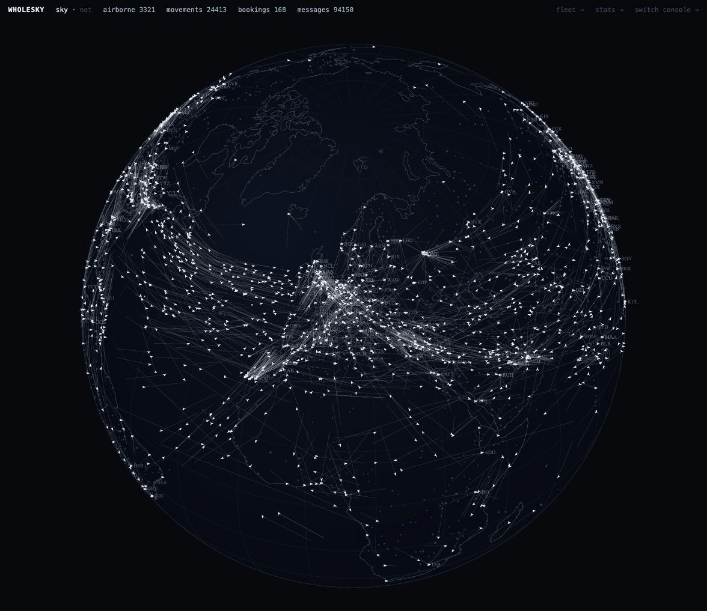
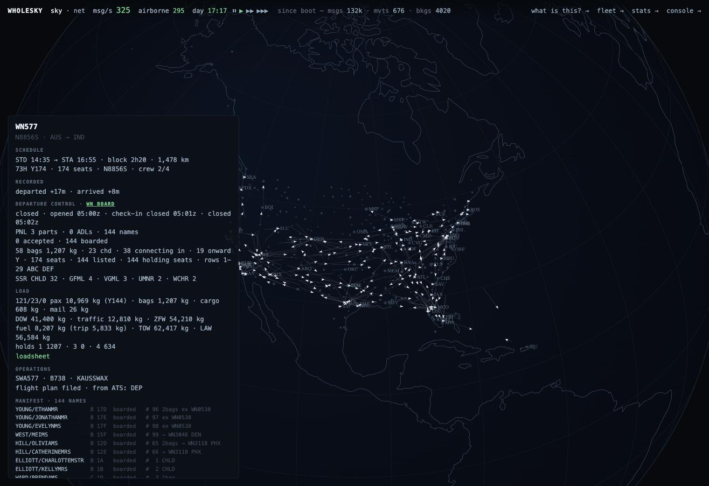
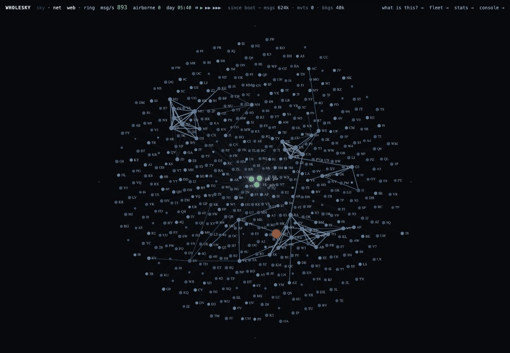
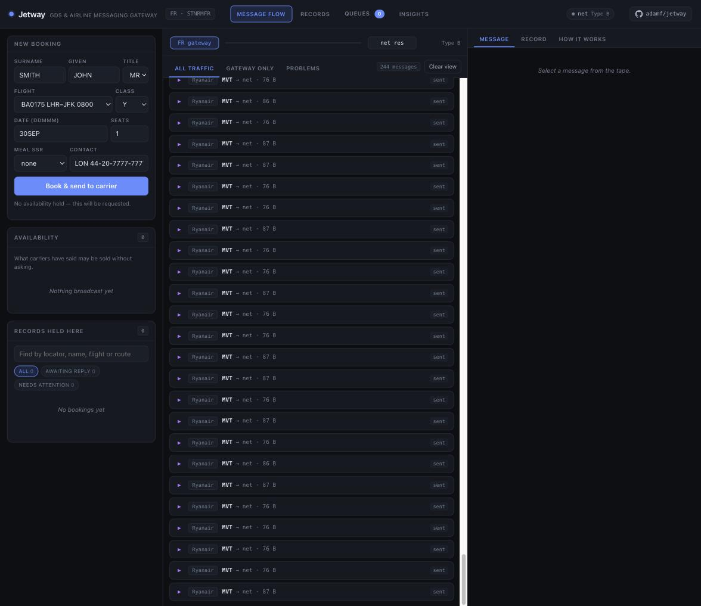
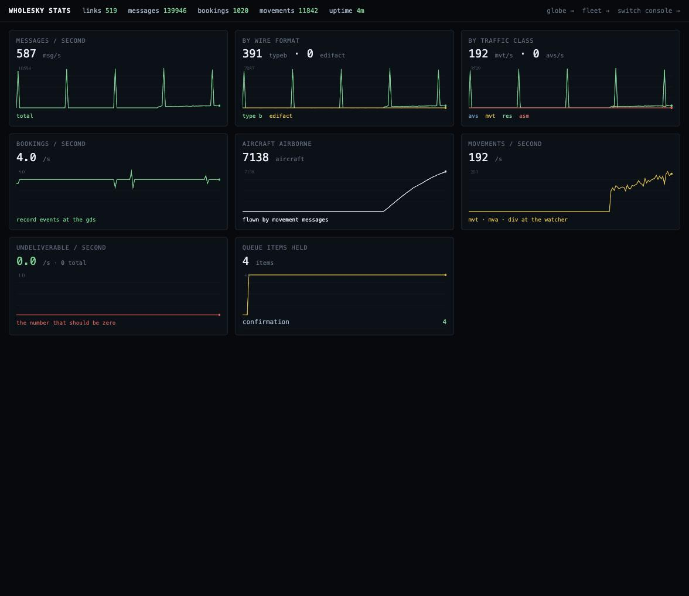
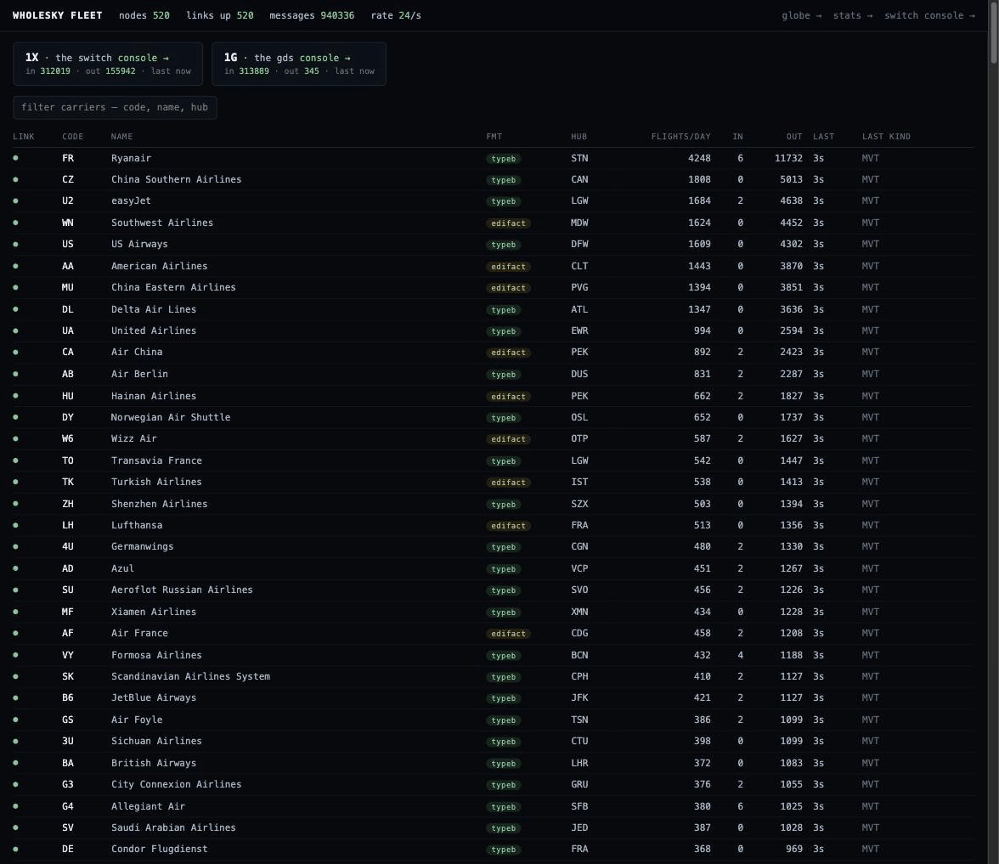
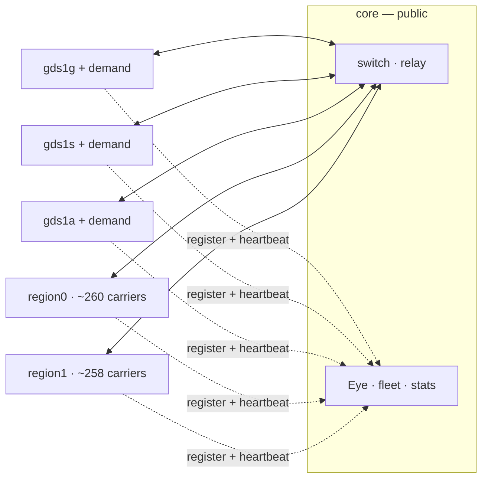
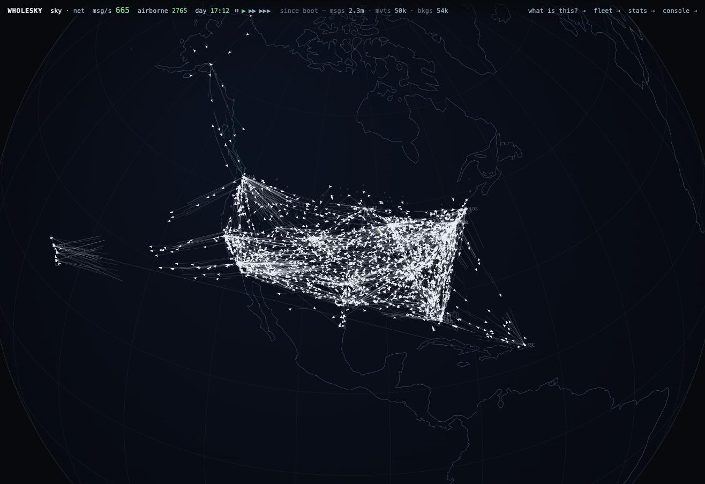
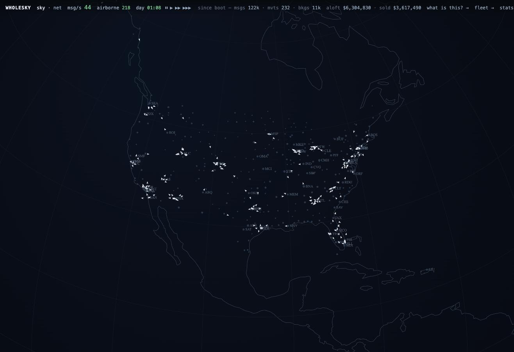
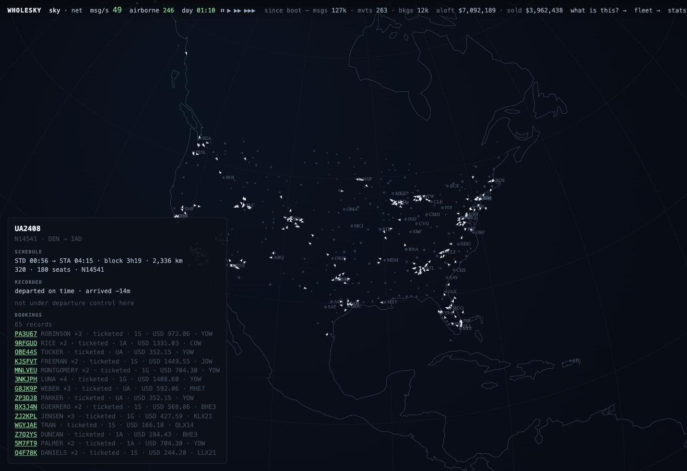

# wholesky

One Earth-day of passenger aviation, simulated on
[Jetway](https://github.com/adamf/jetway): every scheduled flight, every
booking, and every Type B and EDIFACT message that makes it go, over real
sockets.

**Live demo:** https://wholesky-demo.fly.dev/eye — the Eye, watching the
whole sky: 518 carriers, 2,883 airports, 103,688 flights a day — about what
the real world flies — booking at real reservations volume across six
machines. The bar tells you what you are looking at: live messages per
second, aircraft airborne, the sim clock with its own speed controls
(pause the day, or run it at ten hours a minute), and a "what is this?"
legend that names every mark. Click any aircraft for everything the
carrier knows about it.



The flight panel is the carrier's own view of one departure, read live from
the systems that hold it rather than from the map: the schedule and, on a
recorded day, what really happened to it (delay by attributed cause, the
cancellation code, the diversion); departure control's clock, the name
list's parts and amendments, the counts, the seat map by cabin, the
special service requests and connections, the alerts a supervisor would
see; the load and the loadsheet once the door has closed; the operations
desk's callsign, ICAO type, whether the flight plan went and what the
towers said back; the manifest itself, name by name with seat, status and
bags; and the bookings behind those names, under the locators the selling
channels gave them, each one click from the record. The carrier's book is
asked first -- a distribution system's ledger is bounded and turns over in
minutes at this volume -- and when the carrier runs on another machine the
question is federated to it.



The globe has a second mode: **net**, the logical web of who converses with
whom. The switch never appears — it is plumbing. Every relayed message
carries the id of the inbound it forwards, so the Eye resolves each relay to
a true src→dst conversation: carriers to the distribution systems, and carriers to their interline
partners, to whom availability is broadcast the way it really is.
Two layouts of the same graph — a force-directed **web**, where regional
communities pull themselves together by their own message springs (China
upper-left, the Americas upper-right, Europe below, with no geography told
to the layout), and a **ring** with the conversations as woven chords.
Everyone-talks-to-a-GDS is drawn as faint wallpaper; the ink goes to the
carrier-to-carrier web. Drag to pan, scroll to zoom, and every node is one
click from its own console.



**Every node has a real console.** Each of the 522 Jetway systems — the
switch, three distribution systems, and all 518 carriers — serves the full
Jetway console
at `/node/{code}/`, wearing its own identity: open `/node/FR/` and you are
inside Ryanair's reservation system, its own message tape, records and
queues — proxied transparently to whichever machine runs it.



And `/stats` is the cluster's instrument panel: ten minutes of time series at
two-second resolution — message rates by wire format and traffic class,
bookings, airborne count, queue depths, name-list and baggage traffic, and
undeliverable-per-second, the number that should be zero. The availability
rebroadcast cycle is plainly visible as a heartbeat in the charts.



Behind the globe sits **the fleet** at `/fleet`: every Jetway system in the
world as a live row — the switch, the distribution systems, and all 518
carrier tenants with their hubs, dialects, transports (a share of the
teletype world dials in over MATIP), link state and message counters,
merged live from every machine in the deployment. Click a carrier for its
records, queues and message log; click a message for the bytes as they
crossed the wire; sever its circuit and watch the undeliverables bleed
until you restore it.



The coastlines are [Natural Earth](https://www.naturalearthdata.com)
1:110m, public domain, vendored at 76KB and embedded in the binary -- the
traffic still draws the cities. Drag to spin, scroll to zoom, and click any
airport for the one control the sky answers to:
**close it**. Every operating carrier then transmits a real ASM cancellation
for each affected flight, the GDS ingests them through the same
schedule-change path production traffic uses, and the red halo that grows
over the airport is a count of actual queue items -- bookings a person now
has to deal with. Closing Heathrow cancels ~680 flights in about seven
seconds of message traffic. Reopening it stops the cascade
mid-flight. And aircraft already airborne toward a closed airport do not
vanish: their operating carriers transmit real **DIV** messages naming the
nearest open alternate, the Eye reroutes each aircraft when the message
reaches the watcher, and the diverted planes turn amber as they turn away.

Every aircraft on that map is flying because a real MVT message crossed the
switch; the Eye subscribes to the buses the world already publishes on and
knows nothing the network cannot see. The stats line counts messages,
movements and bookings as the seeded demand books through the switch in both
wire dialects. The switch's own console lives at the root — open any message
and read it field by field.

Design: "The Whole Sky" (design note, 2026-08-31). The short version — the
sky is loud but it is not big. The world's reservation fabric peaks at a few
thousand messages a second; simulated honestly, with availability at its real
churn and a baggage message per bag per scan, it is still only tens of
thousands. What is interesting is not throughput but topology, and the
topology here mirrors the real one:

- **The switch** is a Jetway node in relay mode: the SITA role. Everyone
  holds one link to it and addresses everyone else by teletype address.
- **Carriers** are tenants of a host process — most of the world's carriers
  are tenants of a handful of hosted reservation systems, so the efficient
  shape and the realistic shape are the same shape.
- **The GDSes** are Jetway gateways with one switch link each and a peer
  entry per carrier. A booking's sell crosses two links and comes back
  confirmed — and capacity holds across channels, because the carrier's
  inventory is the single authority every channel converges on.
- **OTAs are not nodes.** They are demand: load generators speaking NDC and
  booking APIs. (Phase two.)

## How it is put together

Two shapes, one codebase. **Single-box** (`-role all`, the default and the
test bed): one OS process, every Jetway instance a library assembly,
everything between them crossing real TCP on loopback. **Multi-machine**
(the deployed demo): the same assemblies spread across six machines, dialled
together over a private network — and the switch cannot tell the
difference, which is the point.

The deployed shape splits along the world's real seams:

- **core** — the switch (a full `jetwayd` in relay mode) and the
  instruments: Eye, fleet, stats, and the only public HTTP. It flies its
  globe entirely from its own switch bus, because every movement crosses
  the switch, whoever it was addressed to.
- **gds1g / gds1s / gds1a** — one distribution system each, plus its share
  of demand: ~3,500 bookings a minute between them, which is real global
  reservations volume. Bookings happen at the GDS, so that is where the
  load lives.
- **region0 / region1** — the 518 carriers, sharded by stable hash, their
  books of record in one shared Managed Postgres (one node per carrier,
  purged when the simulated day ends, because 259 reservations systems'
  records in RAM is what the 4GB machines ran out of), each
  region flying its slice of the flight day and running its carriers'
  airports: every tenant is a reservations system *and* a departure
  control system, and the two talk over the network like the separate
  systems they usually are (PNL, ADL, BSM, BPM in; PFS, PTM, PSM, ETL,
  LDM, CPM out).

Federation is deliberately dumb: peers register with the core and heartbeat
every few seconds; the reply carries the switch's link addresses, the
current warp and the closed-airport set, so liveness, time control and
chaos all propagate on one pulse. The fleet board merges every peer's rows
and proxies drill-downs and consoles to whichever machine owns the node.



In single-box mode the only full `jetwayd` is the switch -- the same
assembly the standalone binary runs, console included. The distribution
systems and every carrier are embedded gateways: own identity, own store,
own console, one socket each.


What is real: the wire (521 sessions, real framing, real Type B and EDIFACT
bytes, relay by address line and UNB recipient) and the state separation
(nothing moves between nodes except a message). In the deployed shape the
process isolation is real too -- a region can die and restart while the
rest of the sky keeps flying, and rejoining is just registering and
dialling back in. The topology mirrors the real industry either way: most
carriers are tenants of a handful of hosted systems, and everyone hangs off
one message network.

## The recorded day

The synthetic world flies a schedule the compiler made up from real routes.
The recorded world flies a day that happened. `worldc -bts` reads one day of
the Bureau of Transportation Statistics' on-time performance file -- every
US scheduled passenger flight, with its tail number, its scheduled and
actual times, why it was late, whether it was cancelled and why, whether it
diverted and where -- and compiles a manifest whose flights are those
flights.

```sh
go run ./cmd/worldc -bts data/bts/2025-11-26.csv -date 2025-11-26 -o thanksgiving.json
go run ./cmd/skyd -world thanksgiving.json -warp 1 -demand 800 -sell-days 1
```

The Wednesday before Thanksgiving 2025: 22,889 flights, 20 operating
carriers, 351 airports, 5,313 real airframes, 64 cancellations, 44
diversions, 7,157 flights sold under a major's number and flown by a
regional. At warp 1 the day takes a day: the delays are the recorded ones
and the MVTs carry the record's causes as reason codes; a cancelled flight
is announced by ASM two hours out, after its counter has opened; a diverted
one sends its DIV to the field it really landed at. What stays synthetic is
labelled in the manifest: aircraft type inferred from carrier and stage
length, seat counts, and the passengers, whom BTS does not count. It runs
at https://wholesky-thanksgiving.fly.dev from `fly.thanksgiving.toml`, at
warp 1, so the day before Thanksgiving takes the day before Thanksgiving.



The passengers were the thin part. Demand at 800 bookings a minute puts
about two bookings on each of 22,889 flights, so the name lists were short
and most flights closed with a handful of names. `-fill` is the weeks
before the day: `internal/fill` reads the schedule and writes each
carrier's book of record before the day runs -- parties weighted the way
holiday travel is, itineraries that connect on legs that actually connect
(a fifth of them continue onto a second leg of the same carrier), booking
classes, children and infants, special service requests at their real
rates, a ticket per name, the carrier's own locator and the selling
channel's, booking dates spread over the months before -- deterministically
from a seed, straight into Postgres with `COPY` (jetway's
`Store.LoadPNRs`), and again after each end-of-day purge. The demand
generator then rides on top as what it is on the day of travel: the late
trickle. Southwest's day alone is 260,000 records and 530,000 passengers,
written in 24 seconds; a filled 737 sends a three-part name list, and the
first real family folded a Type B line, which is how jetway v0.1.33 and
v0.1.35 came to exist. The recorded day runs at `-fill 0.85`, a holiday
load: 1,400,987 records and 3.1 million seats held before the first
flight, 3.5 GB in Postgres, the distribution systems' own books beside
them. The filler knows each aircraft's cabins -- the same computation the
inventory uses -- and puts a party in a cabin with room for it on every
leg, because nine per cent business of a widebody's seats is not the
business cabin's size. What full load costs is worked out in
[docs/full-throttle.md](docs/full-throttle.md).

Every one of those records was sold at a fare. jetway's `pkg/fare` is the
structure of a filing -- fare basis, rules for advance purchase, stay,
season, change and refund, taxes by kind, passenger types at their
discounts -- and carries no fare of its own, because ATPCO's are licensed;
`internal/tariff` files a synthetic one from the schedule's distances,
fourteen booking classes to a market with US-shaped taxes, and every
booking prices against it as of its purchase date. The bar at the top of
the globe says what the aircraft in the air were sold for and what has
been bought since boot; the ledger behind it is rebuilt from the books at
every start. The recorded day comes to $719M across 29,967 legs, an
average of $255 a passenger-leg, median $204, taxes 15%: full-fare Y
around $341, business $750 to $785, the deep discount buckets $93 to
$160. The shape of a real Thanksgiving Wednesday, every cent of it
labelled synthetic.





The world also answers for its laws while it flies. Every shard reports
its inventories at `/shard/invariants.json`, the core federates them at
`/invariants.json`, and `go run ./cmd/skycheck <url>` exits non-zero on a
cabin holding more than it has or a shard that did not answer:

```
$ go run ./cmd/skycheck https://wholesky-demo.fly.dev
6 shards, 8074 cabins, 126321 seats sold, 0 oversold
```

Its first run against the recorded day found 88 oversold cabins, 83 of
them business cabins on Hawaii legs holding up to 54 passengers in 32
seats -- the filler had drawn booking classes without looking at the
aircraft. The gate paid for itself on its first run; the in-process suite
(`internal/sim/invariants_test.go`) keeps the laws that need the wire
quiet, message conservation and interline convergence.

## Building it

wholesky pins [Jetway](https://github.com/adamf/jetway) by tag, so it builds
like any Go module:

```sh
git clone https://github.com/adamf/wholesky
cd wholesky && go test ./...
```

To develop against an unreleased Jetway, add a `replace` directive pointing
at a side-by-side checkout and drop it before pushing.

## Running it

```sh
go run ./cmd/worldc -countries "United Kingdom,France,Germany" -carriers 30 -o europe.json
go run ./cmd/skyd -world europe.json -carriers 12 -book 8 -warp 240
```

`worldc` compiles a deterministic manifest — airports, carriers, daily
flights — from the vendored OpenFlights snapshot. Same seed, same world.
`skyd` boots it: switch, tenants, GDS, real TCP on loopback, then pushes
bookings through the fabric and runs the flight day at `-warp`, emitting a
real MVT for every departure and arrival. The switch's console is Jetway's
own, on `-console`, where every message can be opened and read field by field.

## Running a carrier

Every carrier flies on autopilot. Take one over at `/ops/` (the lobby; then
`/ops/<code>`): department by department you switch the autopilot off, and
where it is off the day asks you -- announce this delay or hold it, cancel
this crew-timed-out flight or call reserves, take this slot or ask for a
better one, rush these bags or hold them -- with a default that happens if
you are slow. The levers (cancel, retime, substitute, close a class, move
the fares, REA, reserves) go out on the wire as the real messages. The
scorecard -- revenue, the world's cost shape, on-time, cancellations -- is
the same for every carrier, so the autopilot is the bar.

The same thing for agents: the JSON API under `/carrier/<code>/…`, and
`cmd/skyagent`, an MCP server over stdio that Claude Code or Claude Desktop
can start pointed at a world. The design, the API and the road to a
federated multiplayer sky (bring your own jetway, worlds trunked to worlds)
are in [docs/run-a-carrier.md](docs/run-a-carrier.md). The first step of
that road works: claim a carrier you hold (`POST /carrier/BA/claim`) and the
world severs its own tenant and hands you the jetway configuration, link
token and SSIM schedule for your own `jetwayd` to dial in as BA -- on the
demo, over the internet, at `wholesky-demo.fly.dev:7000`.

## Status

Works, and `go test ./...` proves it on every run: world compilation at any
scale from a continent to the planet, deterministic by seed; the
switch/tenant/GDS topology over real sockets; bookings settled in **both
dialects** -- AIRIMP over Type B and PADIS over EDIFACT -- and over MATIP
for the share of the teletype world that dials in on the airline transport;
a demand model that lives with its bookings (connections, interline,
parties, ticketing, cancellations, divides, a slice arriving as NDC
orders); the whole ground story per departure — reservations sends the
name list at T−180, departure control (Jetway's `pkg/dcs`) opens the
flight, the counter fills in waves with real seat assignments and bag tags
sent to the sortation system as BSMs, the ADL diff lands at T−60, check-in
closes at T−45 and standbys clear, boarding runs from T−30, the sortation
system reports the hold as a BPM, and the door closes at T−10 producing
the final sales back to reservations (no-shows written onto the bookings),
the transfer and service lists to the arrival station, the ticket list to
revenue, and the load and container messages with an AHM 560-method
loadsheet — so the MVT's passenger count is who boarded, not a guess, the hold reconciled against the cabin before the door closes (an
unaccompanied bag holds it until sortation pulls the bag); a
connecting passenger misses the flight when the inbound is late enough;
every carrier answers sells from the aircraft's own seats (jetway's
`pkg/inventory`: cabins from the fleet's layout, pooled per leg, rebuilt
from the book of record at every start and purge), under a nested class
ladder set by an EMSR-b revenue management controller from a forecaster
that reads the booking curve on the world's clock (sold so far plus the
pickup still to come), so a filled 737 confirms what is left, closes its cheap
classes while full fare is still open, waitlists the next party and
refuses after that, and turns away a connecting passenger whose through
fare does not cover the seats it would take from two flights' local
passengers (bid-price control), and the availability it broadcasts says how many seats remain;
every booking is priced before it sells against a fare filing derived from
the schedule (jetway's `pkg/fare`: a ladder of classes per market with
basis codes, advance-purchase and stay rules, change fees and refundability,
and taxes shaped like a US domestic ticket), so a same-day sell pays full
fare, a cheap class that the rules will not sell is refused with the rule
named, and the money is on the record and the ticket coupons -- the fares
are synthetic and labelled, the structure is the industry's;
the other two networks — each machine runs a datalink service provider
and an air navigation service provider beside the airlines: an aircraft
reports OUT and OFF over its datalink, the provider forwards the ARINC 620
report to the airline's operations desk over Type B, and the MVT the world
runs on is derived from it rather than asserted; operations files an ICAO
flight plan with the towers at both ends over the AFTN an hour before
departure, and the towers send their DEP and ARR back over it when the
aircraft moves, addressed by the airline's ICAO designator;
codeshares — 7,157 of the recorded day's flights are sold under a major's
code and flown by a regional, and the marketing carrier sells them: it
answers for the seats from the operating leg's cabin, forwards each sale
to the operator as an interline sell, and relays a cancellation under its
own number; the globe's bar prices the sky, what every ticket on an
aircraft now in the air was sold for and what the day's purchases came to;
irregular operations — when a flight is cancelled, by chaos or by the
record, the distribution systems' irops engines work the schedule-change
queue the way a desk does: the next flights over the same city pair, own
metal first, free sale where the cache offers it and a request to the
carrier where it does not -- own metal first, then the codeshares the
carrier markets under its own number, then interline -- each request
waited on until the carrier answers — a confirmed seat drops the dead leg with a real sell and a real
cancel on the wire, a waitlist is kept and named, a refusal comes off the
record — while the airport offloads whoever had checked in and pulls their
bags; what nothing can carry stays on the queue for a person; the
other airline's connecting passengers through-checked over IATCI, one
interline connection in four, the onward seat on the manifest; every
international door close telling the state who is on board (APIS, to the
public PAXLST guide) and pushing the records with seats and bags (PNRGOV,
to the public PADIS guide), with a reservations-only push when the name
list goes out; one flight in a hundred and fifty going technical after
check-in opens, a smaller aircraft taking it, the cabin re-seated, the
overflow denied boarding by name, the inventory shrunk and distribution
told by ASM EQT; a flight running forty-six minutes or more late
announced two hours out as an ASM TIM, the sold segments moved to the new
times at TK on every distribution system; the day's schedule written as
an SSIM chapter 7 file (`worldc -ssim`) and flown from one (`skyd -ssim`),
so a carrier's own schedule file is a source; two message switches joined
by a trunk (`skyd -switches 2`), every carrier homed on one by hash, so a
booking on a carrier across the trunk sells and settles the way traffic
between the real network's providers does; a settlement plan that hands
every airline its BSP HOT file (jetway's `pkg/bsp`, to IATA's public DISH
23 handbook) for the day the agents sold, at boot and at every day wrap,
reconciled against the carrier's own book -- teletype carriers now hear
their ticket numbers as SSR TKNE so the books agree -- served at
`/settlement.json` and `/settlement/<carrier>.hot`, with the day's gross
on the globe's money bar; interline billing between carriers -- every
codeshare coupon flown by one carrier on another's ticket prorated by
mileage (jetway's `pkg/prorate`) and invoiced, less the interline service
charge, at `/billing.json`; refunds -- a ticketed booking that cancels is
refunded first, and the plan reports the document again as a refund with
the amounts reversed; a bag the hold never reported rushed on the next
flight over the sector, with a BUM ahead of it to the arrival station; a reprotected passenger's
ticket reissued over the new itinerary (an involuntary exchange), which the
settlement plan carries with the original issue behind it;
tail rotations and a deterministic
delay model; an adjustable sim clock; chaos that closes airports and cuts
carrier circuits; an invariant suite (no oversell — including across
selling channels — message conservation, interline convergence,
cancelled-flight-queues-everyone), with the no-oversell law also asked of
the live sky by `go run ./cmd/skycheck <url>`, which federates every
shard's inventory and exits non-zero on a cabin over capacity or a shard
that did not answer; and a multi-machine test that boots
core, GDS and region in one process and proves a booking crosses three
machines and settles. At warp 60 — a day every twenty-four minutes, some
17,000 aircraft airborne — the departure banks peaked above 16,000 messages
a second through the six-machine fabric; the demo now runs at warp 6, a
four-hour day, so a departure's ground story unfolds at a pace a person can
watch and each flight carries ten times the bookings. What it would take
to fly real loads is worked out in [docs/full-throttle.md](docs/full-throttle.md).

The pattern that keeps paying: every time the world gets bigger, it finds
real bugs in Jetway — eighty-five releases so far, each fix landed upstream with
a regression test that was watched to fail first. Not yet: filling a
recorded day to its real passenger load, weather systems that close regions
rather than airports, and booking curves with real seasonality. The
longer list of what a full airline runs and this world does not is in
[docs/missing-systems.md](docs/missing-systems.md); what it would take to
run jetway itself in production, on Google Cloud with real load and high
availability, is in
[jetway's docs/production-gcp.md](https://github.com/adamf/jetway/blob/main/docs/production-gcp.md).

## Licence

MIT. The vendored OpenFlights data is separately licensed under the Open
Database License; see Data below.

## Data

`data/` vendors the [OpenFlights](https://openflights.org) database
(airports, airlines, routes), Open Database License. The snapshot is
deliberately allowed to be stale: the simulation needs a plausible planet,
not this year's planet. A current OAG or Cirium snapshot dropped through the
same compiler produces today's world instead.
